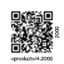
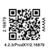
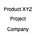

# LabelsGen
Utility to generate labels that include QR codes for generic products

Below few examples:

|Sequence|File|Schema|
|---|---|---|
||||

Examples above refers to 1x1inch pages, used for Dymo labelwrites printers. The page size can be configured.

If you find this tool useful, please [](https://www.buymeacoffee.com/ricsxn)

## Setup
Before proceeding with the setup, ensure that the following prerequisites are satisfied by your system:

* Python3
* Python PIP
* Virtualenv

### Python3
Most modern operating systems are already providing Python3 interpreter. Verify its presence executing from a console the command `python3 --version`.
If the python interpeter is not available, please refer to the python [download](https://www.python.org/downloads/) page.

### Python PIP
To verify that PIP is available in your system just execute `pip --version`. In no PIP is present, just execute below commands:

```bash
curl https://bootstrap.pypa.io/get-pip.py -o get-pip.py
python3 get-pip.py
```
In case `curl` command is not available, download the [get-pip.py]( https://bootstrap.pypa.io/get-pip.py) file manually.

### Virtualenv
To check the presence of the virtualenv, just execute `python3 -m venv`, it sould report che usage of the tool. If the virtualenv is not present, use PIP to install it:

```bash
pip install virtualenv
```

### `labelsgen` command installation
To install 'labelsgen' command, just execute the commands below:

   ```bash
   cd <labelsgen path>
   python3 -venv venv
   . venv/bin/activate
   pip install .
   ```

## Usage

The `labelsgen` command foresees different options, as reported by its usage instructions:

```bash
$ labelsgen 
This utility creates a PDF file containing label pages including products QR codes 
    Usage: labelsgen <first_product_number> [number_of_products=1]
                 -v
                 -f <file_labels>
                 -s <schema_labels>
                 -h|--help show this page

    Where:
      -v open the generated QR labels file
      'file_labels' is a text file containing a single product data and optionally a text placed on the right side
      'schema_labels' file containing the description of the labels to generate

    The utility can be configured changing the 'labelsgen_conf.json' file
```

* Generate a sequence of labels containing QE codes of products providing the first serial number and the number of successive products

  ```bash
  labelsgen <first_product_number> [number_of_products=1]
  ```

* Generate QRs specified into an input file

  ```bash
  labelsgen -f <file_labels>
  ```

  where `<file_labels>` contains UPI line records in the format: 

  ```bash
  <product url> [<product serial>]
  ```

* Generate a custom page providing a shema file

  ```bash
  labelsgen -s <schema_labels>
  ```

  The schema file consists of a json file containing instrucitons to generate cusstom pages. To see how to configure the page, see the chapter [Page schema composition]()

  ## Page schema composition
  The schema file consists of a json array of objects in which each element specifies instructions to generate a single page.
  Each object contains one or more graphic elements being part of the page using the strucure:

  ```json
  {
   "<name of the element 1>": {
     <description of the element 1>
   },
   "<name of the element 2>": {
     <description of the element 2>
   }
  }
  ```
  The name of the element has only informative purposes, while each element is characterized by a "type" attribute value. Each type foresees different properties.
  Object property names are self explanatory, just consider that values are expressed in terms of page percentage and objects will be centered respect to the specified position.
  
  The schema supports the following element types:

  ### Label
  To specify a label (a texutal element), specify the object:

  ```json
  "product_code": {
    "type": "label",
    "font": "Helvetica",
    "font_size": 6,
    "text": "4.7.6/ACTIVE/3.XX",
    "x": 0.50,
    "y": 0.08[,
    "rotation": 90
    ]
  },
   ```
   The `rotation` property is not mandatory.


   ### qr
   This type represent the given `text` into a QR code image having specified position and size.

  ```json
  "product_qr": {
    "type": "qr",
    "qr_size": 0.68,
    "text": "https://<mysite>/products/3.XX",
    "x": 0.50,
    "y": 0.52
  }
  ```

   ### image

  ```json
  "company_logo": {
    "type": "image",
    "path": "images/company_logo.png",
    "width": 0.3,
    "height": 0.3,
    "x": 0.50,
    "y": 0.20
  }
  ```

All different execution modes can be specified in a single command line:

```bash
labelsgen -f file_labels.txt -s schema_labels.json 2000 5 -v
```


## Configuration
The `labelsgen` command can be configured changing the configuration file `labelsgen_conf.json`.
Below the default settings:

```json
{
  "page": "Multipurpose Labels",
  "qr_url_prefix": "https://<mycompany>/product/",
  "qr_url_product_prefix": "<product>/4.",
  "sequence_labels": "sequence_labels.pdf",
  "file_labels": "file_labels.pdf",
  "schema_labels": "schema_labels.pdf",
  "qr_size": 0.78,
  "text_left_x": 0.12,
  "text_right_x": 0.92,
  "text_bottom_y": 0.06,
  "font": "Helvetica",
  "font_size": 6,
  "pages": [
    { "name": "Multipurpose Labels",
      "width": 1.0,
      "height": 1.0
    },
    { "name": "24x48 labels",
      "width": 1.0,
      "height": 2.0
    }
  ]
}
```

Configuration options are self explanatory and they principally affect the  QR generation in sequence and using the configuration file.
The `pages` array and `page` define the page size.
The `*_labels.pdf` are the PDF file names produced using numeric sequence, input file or schema